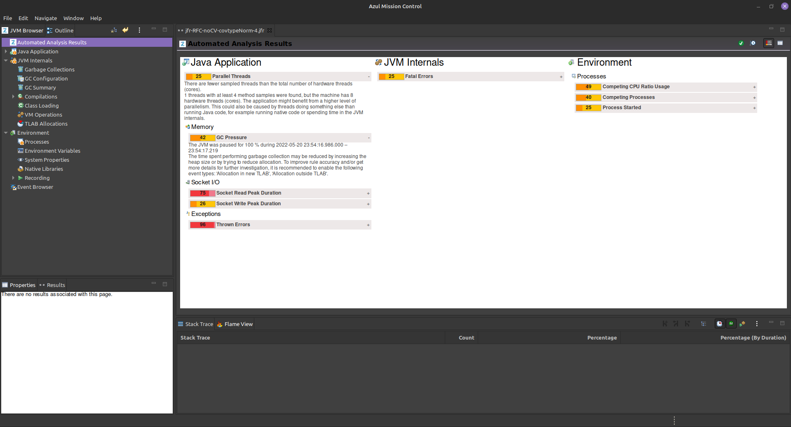
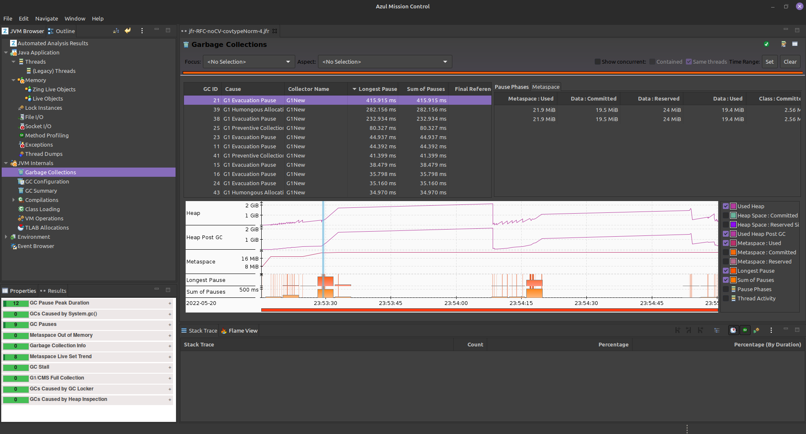
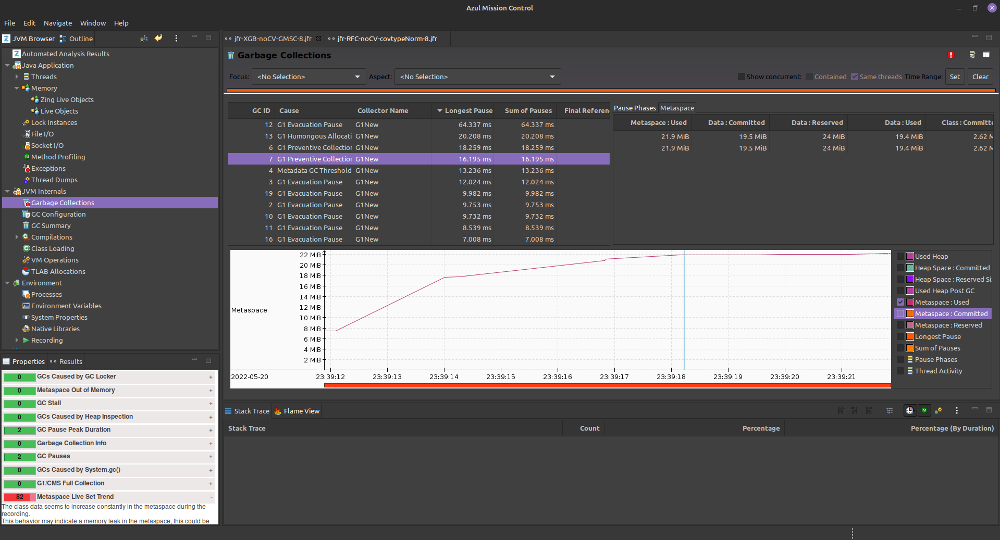
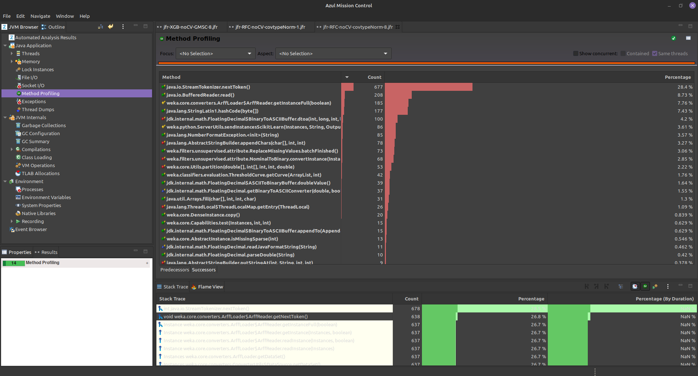
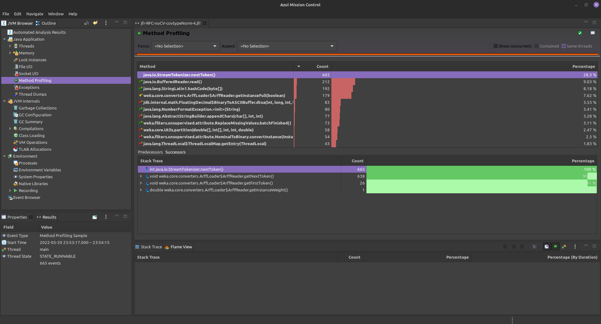
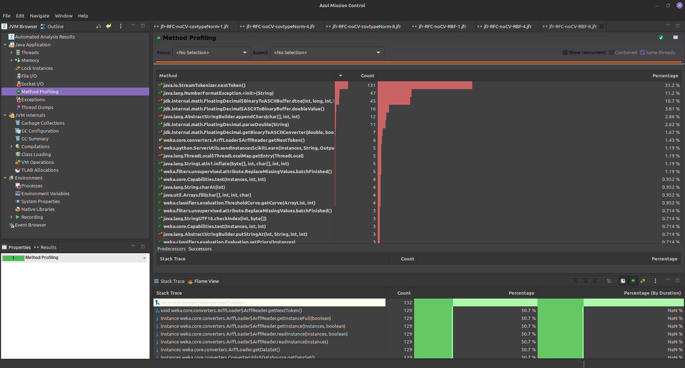
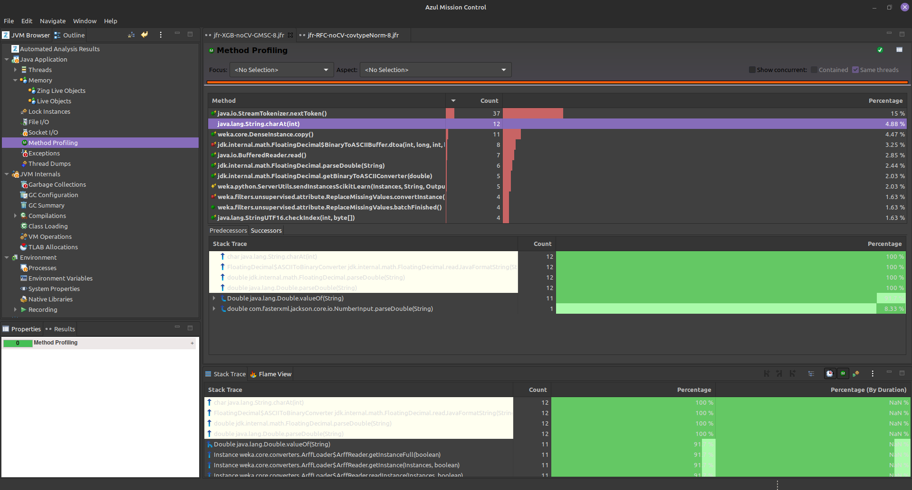
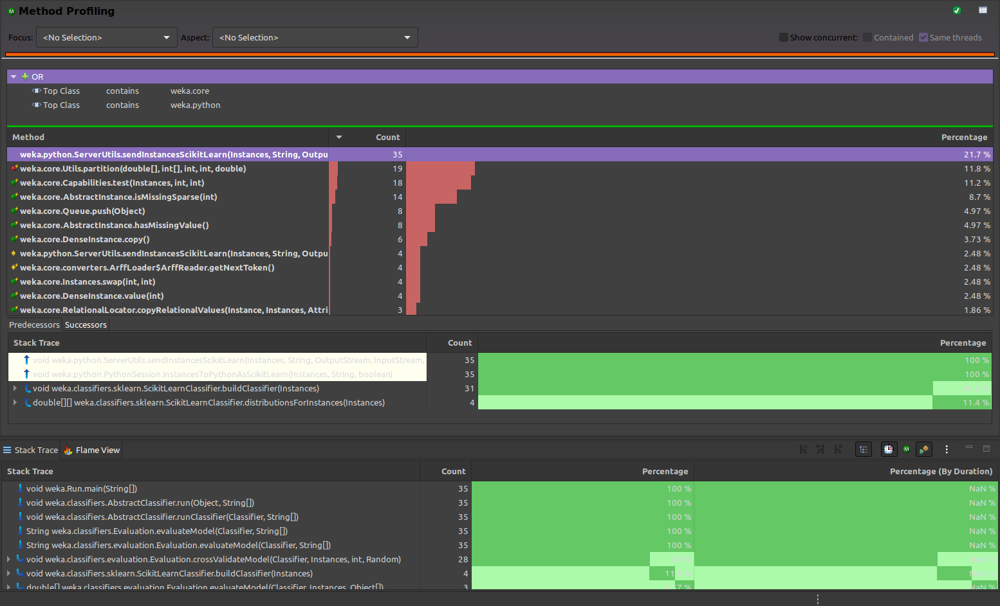

# T3: Profiling de algoritmos de machine learning do Weka / wekaPython  

Nome: Leonardo Cargnin Krügel   
Disciplina: ELC139 - Programação Paralela - UFSM - 2022a  

## Testes Realizados  
| Algorítmo  | dataset | n_jobs |
|---|---|---|
| XGBoost | GMSC | 1-4-8 |
| XGBoost | RDG1 | 1-4-8 |
| RandomForest | Covertype | 1-4-8 |
| RandomForest | RandomRBF | 1-4-8 |

## Resultados  
Algumas imagens dos resultados gerados com o JFR e observados no JMC: 

1. Análise automática gerada pelo JMC. 

2. Análise do *garbage collector*.

3. JMC avisando sobre um possível vazamento de memória no *metaspace*.

4. Comparativo entre os tempos de execução dos métodos com diferentes combinações. 
    1. RandomForest - Covertype - 1 job   
    2. RandomForest - Covertype - 4 jobs   
    3. RandomForest - RandomRBF - 8 jobs 
    4. XGBoost - GMSC - 8 jobs   

## Questões  
1. Qual o efeito do parâmetro *n_jobs* sobre o tempo de execução de cada algoritmo e dataset?  
De maneira geral ocorre um ganho bastante significativo de desempenho no tempo de execução para todos as combinações de datasets e algorítmos. Algumas observações:  
    - Existe um grande salto de desempenho para todas as combinações de algorítmos e datasets ao trocarmos *n_jobs=1* para *n_jobs=4*;
    - Para o algorítmo XGBoost o ganho de desempenho ao passarmos de *n_jobs=4* para *n_jobs=8* é ínfimo;
    - O algorítmo RandomForest tem seu tempo de execução diminuído em pelo menos 3 vezes ao passar de *n_jobs=1* para *n_jobs=8*;
    - De maneira geral, aumentar *n_jobs* diminui o tempo de execução, porém os ganhos em tempo de execução são decrescentes.

2. Usando o JMC, como o tempo de execução se divide entre os diversos métodos invocados em cada caso?  
Analisando os perfis gerados podemos perceber uma váriação considerável na distribuição do tempo entre os métodos ao utilizar o mesmo algorítmo porém com um *dataset* diferente e uma pequena variação (talvez devido ao pequeno número de amostras) ao alterar o *n_jobs*. Ao alterar o algorítmo o perfil altera bastante.  
Independentemente do algorítmo/*dataset*/*n_jobs*/ o perfil de execução passa a maior parte do tempo em métodos invocados pelo weka, como no exemplo abaixo.
  
